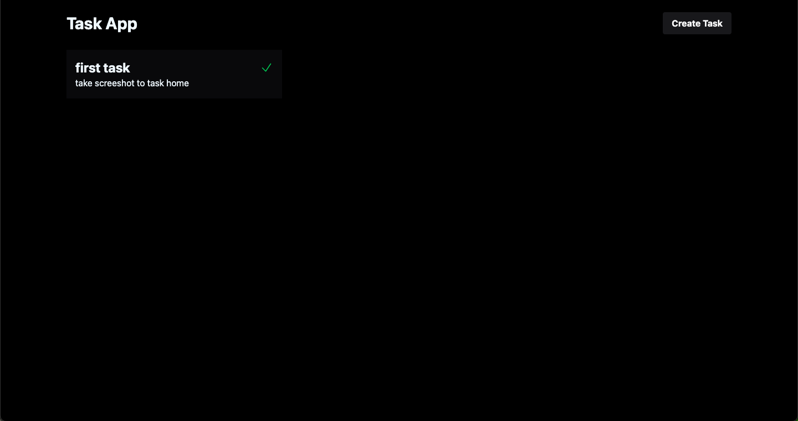

# Task Board.

create a task board with FARM stack.


## Demo




## Installation


1. Clone  the github Proyect.
2. you can use ```dockercompose up``` to run. or you can to run   a spesific  proyect . 
    1.``` npm run dev from ``` react client with the port 5173 app  2.```uvicorn main:app --reload```to fastapi backed app with port 8000 3. the proyect use mongodb with the port 20017.

    

    
## License

[MIT](https://choosealicense.com/licenses/mit/)

